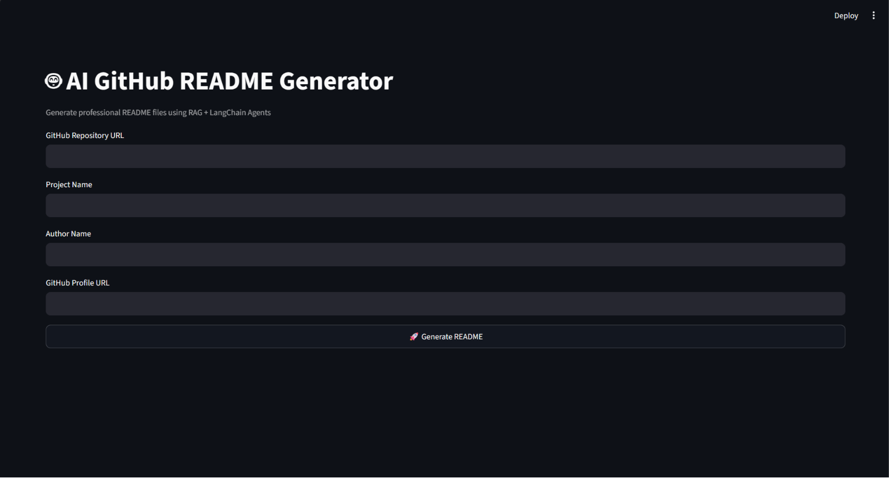

# 🤖 AI README File Maker

An AI-powered **GitHub Repository README Generator** that analyzes a repository and automatically creates a structured, professional `README.md` file.

The project uses a **RAG-based pipeline** to collect repository context and combines multiple LLM agents to generate different parts of the documentation, including installation instructions and project architecture.

---

## ✨ Features

* 🔗 Accepts a GitHub repository URL
* 📥 Automatically clones the repository
* 🔎 Creates searchable context from the repository
* 🧠 Uses Retrieval-Augmented Generation (RAG)
* 🤖 Uses multiple AI agents
* ⚡ Uses **Groq** for generating installation instructions
* 🌊 Uses **Mistral** for explaining project architecture
* 📝 Automatically generates a README file
* 👤 Supports custom author information
* ⭐ Adds GitHub project/star information
* 🏗️ Analyzes the repository architecture before generating documentation

---

## 🧠 How It Works

The application follows a multi-step pipeline:

```text
GitHub Repository URL
        │
        ▼
┌──────────────────┐
│  Clone Repository│
└────────┬─────────┘
         │
         ▼
┌─────────────────────┐
│ Build Repository DB │
└────────┬────────────┘
         │
         ▼
┌─────────────────────┐
│ Retrieve Repository │
│      Context        │
└────────┬────────────┘
         │
         ├──────────────────────┐
         ▼                      ▼
┌────────────────┐     ┌────────────────┐
│  Groq Agent    │     │ Mistral Agent  │
│                │     │                │
│ Installation   │     │ Architecture   │
│ Instructions   │     │ Explanation    │
└───────┬────────┘     └───────┬────────┘
         │                      │
         └──────────┬───────────┘
                    ▼
          ┌──────────────────┐
          │ README Generator │
          └────────┬─────────┘
                   │
                   ▼
             README.md
```

The main pipeline is implemented in `rag_engine.py`, where the repository is cloned, the database/context is prepared, repository information is retrieved, and the Groq and Mistral agents are invoked before the README is created.

---

## 🛠️ Tech Stack

### Programming Language

* Python

### AI / LLM

* Groq
* Mistral AI
* LangChain

### RAG

* Repository indexing
* Vector/database-based retrieval
* Context-aware generation

### Repository Processing

* Git
* GitPython
* Repository cloning and analysis

### Backend / Application

* Python application
* FastAPI/application layer

### Configuration

* Python `.env`
* Environment variables
* Pydantic-based project configuration

---

## 📁 Project Structure

```text
readme_file_maker/
│
├── repo_db/
│   └── Repository database / vector data
│
├── repositories/
│   └── Cloned GitHub repositories
│
├── agents.py
│   └── LLM agents and prompts
│
├── agents_README.md
│   └── Agent-related documentation
│
├── app.py
│   └── Application entry point
│
├── config.py
│   └── Project configuration and input definitions
│
├── db.py
│   └── Repository database and context retrieval
│
├── git_clone.py
│   └── GitHub repository cloning logic
│
├── rag_engine.py
│   └── Main RAG pipeline
│
├── readme_maker.py
│   └── README generation logic
│
├── tools.py
│   └── Supporting tools
│
├── interface.png
│   └── Application interface
│
├── mainREADME.md
│   └── Generated/documentation content
│
├── requirements.txt
│   └── Python dependencies
│
└── .gitignore
```

---

## 🔄 Pipeline

### 1. Repository Input

The user provides:

* GitHub repository URL
* Project name
* Author name
* GitHub profile URL

Example:

```text
Repository URL:
https://github.com/username/project

Project Name:
My Project

Author Name:
John Doe

GitHub Profile:
https://github.com/username
```

---

### 2. Clone Repository

The application clones the provided GitHub repository locally.

```python
clone_repo(url)
```

The cloned repository is stored inside the `repositories/` directory.

---

### 3. Build Repository Context

The repository is processed and stored in the project database.

```python
run_db(url)
```

After indexing, relevant repository information can be retrieved through:

```python
load_context(
    "Create a README file for this repository"
)
```

This allows the LLM agents to work with the actual project source rather than generating documentation from only the repository name.

---

### 4. Groq Agent

The first AI agent focuses on installation instructions.

```python
agent1 = agent_groq()
```

It receives repository context and is instructed to generate:

```text
Generate installation instructions.
```

The generated response is stored as:

```python
state["groq_result"]
```

---

### 5. Mistral Agent

The second AI agent focuses on understanding the project architecture.

```python
agent2 = agent_mistral()
```

It receives the same repository context and is instructed to:

```text
Explain the project architecture.
```

The result is stored as:

```python
state["mistral_result"]
```

---

### 6. README Generation

The generated AI responses and author information are combined into the final README.

```python
create_readme(state, url)
```

The generated documentation can then be used as the project's README.

---

## ⚙️ Installation

### 1. Clone the Repository

```bash
git clone https://github.com/AnujrajShrestha/readme_file_maker.git
```

Move into the project:

```bash
cd readme_file_maker
```

---

### 2. Create a Virtual Environment

Windows:

```bash
python -m venv venv
```

Activate it:

```powershell
venv\Scripts\activate
```

Linux/macOS:

```bash
python3 -m venv venv
source venv/bin/activate
```

---

### 3. Install Dependencies

```bash
pip install -r requirements.txt
```

---

## 🔐 Environment Variables

Create a `.env` file in the project root.

Example:

```env
GROQ_API_KEY=your_groq_api_key
MISTRAL_API_KEY=your_mistral_api_key
```

> Never commit your `.env` file or expose API keys publicly.

---

## ▶️ Running the Project

Run the application according to the configured entry point:

```bash
python app.py
```

For directly testing the RAG pipeline:

```bash
python rag_engine.py
```

The pipeline will request information such as:

```text
Enter repository url:
Enter project name:
Enter author name:
Enter github ID url:
```

After providing the information, the repository analysis and README generation pipeline will run.

---

## 🧪 Example

Input:

```text
Enter repository url:
https://github.com/AnujrajShrestha/readme_file_maker

Enter project name:
AI README File Maker

Enter author name:
Anuj Shrestha

Enter github ID url:
https://github.com/AnujrajShrestha
```

The application then:

```text
1. Clones repository
2. Processes repository
3. Builds searchable context
4. Runs Groq agent
5. Runs Mistral agent
6. Combines generated information
7. Creates README
```

---

## 🤖 Multi-Agent Architecture

The project separates documentation responsibilities between multiple LLM agents.

| Agent            | Responsibility                                    |
| ---------------- | ------------------------------------------------- |
| Groq Agent       | Installation instructions                         |
| Mistral Agent    | Project architecture                              |
| README Generator | Combines generated information into documentation |

This separation allows each agent to focus on a specific documentation task rather than asking a single model to generate the entire README in one step.

---

## 🧩 Main Components

### `rag_engine.py`

The central pipeline of the application.

Responsibilities:

* Accept repository information
* Clone repository
* Build repository database
* Retrieve context
* Invoke Groq agent
* Invoke Mistral agent
* Store generated results
* Generate README

---

### `git_clone.py`

Handles cloning of the target GitHub repository.

---

### `db.py`

Responsible for repository processing, database/index creation, and retrieving relevant repository context.

---

### `agents.py`

Contains:

* LLM initialization
* Agent definitions
* Prompts
* Groq configuration
* Mistral configuration

---

### `readme_maker.py`

Responsible for converting the generated agent outputs into the final README document.

---

### `config.py`

Contains project input/configuration structures used by the pipeline.

---

## 📸 Interface



---

## 🔒 Security

Keep API credentials outside the source code.

Use:

```env
GROQ_API_KEY=...
MISTRAL_API_KEY=...
```

and make sure `.env` is included in `.gitignore`.

Do not commit:

```text
.env
API keys
tokens
private credentials
```

---

## 🚧 Current Limitations

This project is currently designed primarily as an experimental AI/RAG README-generation system.

Possible improvements include:

* Better repository language detection
* More specialized documentation agents
* Automatic technology-stack detection
* Better README formatting
* Automatic screenshots/demo detection
* Better handling of large repositories
* Streaming LLM responses
* Web-based frontend
* Deployment support
* Automated README quality validation
* Support for private repositories with authentication

---

## 🔮 Future Improvements

### Documentation Agents

Additional agents could generate:

```text
Installation
Usage
Features
Architecture
API Documentation
Project Structure
Configuration
Environment Variables
Deployment
Contributing
License
```

### Repository Understanding

The RAG pipeline could also analyze:

* Dependencies
* API endpoints
* Database schemas
* Frontend components
* Backend services
* Configuration files
* Docker configuration
* CI/CD workflows

### Automated Documentation

Future versions could automatically create:

```text
README.md
CONTRIBUTING.md
API.md
ARCHITECTURE.md
CHANGELOG.md
```

---

## 🤝 Contributing

Contributions, suggestions, and improvements are welcome.

### 1. Fork the repository

```bash
git fork https://github.com/AnujrajShrestha/readme_file_maker
```

### 2. Clone your fork

```bash
git clone https://github.com/<your-username>/readme_file_maker.git
```

### 3. Create a branch

```bash
git checkout -b feature/your-feature
```

### 4. Make your changes

### 5. Commit your changes

```bash
git add .
git commit -m "Add your feature"
```

### 6. Push the branch

```bash
git push origin feature/your-feature
```

### 7. Open a Pull Request

---

## 📄 License

Add your preferred open-source license to the repository.

If the project does not currently contain a license, users should not assume that the code is freely reusable.

---

## 👨‍💻 Author

**Anuj Shrestha**

GitHub:
https://github.com/AnujrajShrestha

---

## ⭐ Support

If you find this project useful, consider giving the repository a ⭐ on GitHub.

**Repository:**
https://github.com/AnujrajShrestha/readme_file_maker

---

## 🙌 Acknowledgements

Built while exploring:

* Retrieval-Augmented Generation
* LLM agents
* LangChain
* Groq
* Mistral AI
* GitHub repository analysis
* Automated documentation generation

---

## 📌 Project Status

🚧 **Active Development**

The project is being developed as an experiment in combining **RAG + multi-agent LLM workflows + automated software documentation**.
